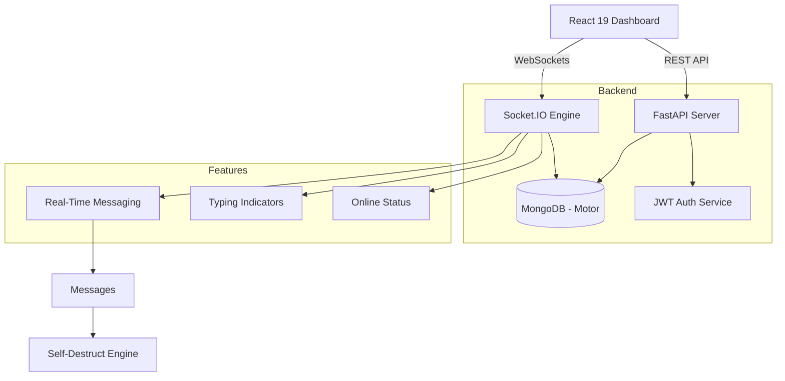

<div align="center">

# 💬 ChatterBox — Real-Time Collaborative Messaging

**A collaborative chat platform featuring real-time group/private messaging, presence tracking, context-aware notifications, and activity statistics.**

[](https://python.org)
[](https://fastapi.tiangolo.com)
[](https://react.dev)
[](https://www.mongodb.com)
[](https://socket.io)
[](LICENSE)

</div>

---

## 📌 Overview

ChatterBox is a modern chat application built for real-time group conversations and private messaging. The project is designed with a focus on responsiveness, secure socket connections, and accurate database tracking, making it an excellent demonstration of real-time full-stack development with MongoDB.

---

## 🏗️ Architecture



---

## 🗂️ Project Structure

```text
chatterbox/
│
├── backend/                        # FastAPI Application (Python)
│   ├── main.py                     # Entry point, lifespan, & Socket.IO setup
│   ├── database.py                 # Async MongoDB connection (Motor)
│   ├── requirements.txt            # Python dependencies
│   ├── models/
│   │   ├── user.py                 # Pydantic Auth models
│   │   ├── group.py                # Group & DM schema definitions
│   │   └── message.py              # Message storage & TTL schemas
│   ├── routes/
│   │   ├── auth.py                 # JWT Authentication & Registration
│   │   ├── groups.py               # Group management & DM lookup logic
│   │   └── stats.py                # Optimized statistics queries
│   └── sockets/
│       └── chat.py                 # Socket.IO connection and event handlers
│
├── frontend/                       # React Application (Vite)
│   ├── package.json                # Node dependencies
│   ├── vite.config.js              # Build configuration
│   └── src/
│       ├── main.jsx                # DOM Entry point
│       ├── App.jsx                 # React Router & Protected Routes
│       ├── index.css               # Global Glassmorphism Design System
│       ├── context/
│       │   └── AuthContext.jsx     # Global Authentication & Socket State
│       ├── services/
│       │   ├── api.js              # Axios interceptors & API instances
│       │   └── socket.js           # Socket.IO connection manager
│       └── pages/
│           ├── Auth.jsx            # Unified Login/Register view
│           ├── ChatDashboard.jsx   # Core Chat UI (Sidebar, Messages, Input)
│           └── Stats.jsx           # Animated Statistics Dashboard
│
├── .gitignore                      # Git exclusion rules
├── LICENSE                         # MIT License
└── README.md                       # Documentation
```

---

## 🚀 Key Features

### 🔒 Security & Identity Protection
- **JWT Route Guard**: All backend routes (like `/api/auth/users`, `/api/groups`, and `/api/stats`) are protected via FastAPI dependencies.
- **WebSocket Handshake Validation**: Socket connections are authenticated via JWT validation during handshake (`socket.auth.token`).
- **Anti-Spoofing Checks**: The backend maps sockets to verified user database IDs (`connected_users`). Unverified sender payloads from the client are ignored to prevent identity spoofing.

### 📡 Real-Time Interactions & Presence
- **Instant Messaging**: Real-time message delivery with seen receipts (`✓` sent, `✓✓` seen).
- **Multi-Tab Presence Tracking**: The system tracks active connections per user. Users are marked offline (`isOnline: false`) only when their last browser tab/window is closed, preventing offline flickering on refresh.
- **Race-Condition-Free Group Creation**: When a group/DM is created, the backend automatically joins all active member connections to the new room instantly, guaranteeing they receive the first messages in real time.
- **Typing Indicators**: Visual indicators showing when a user is typing inside the active chat.

### 🔔 Context-Aware Sounds & Toast Notifications
- **Web Audio Chimes**: Chime sounds are synthesized dynamically on the fly via the browser's Web Audio API.
- **In-App Toast Popups**: Sliding glassmorphic toasts display message previews.
- **Smart Notification Rules**: 
  - Sounds and toasts are silenced if you are actively viewing the chat tab and looking at that open room.
  - If you switch tabs, look at another chat, browse the People/Groups tab, or minimize the browser, sound and toast alerts trigger instantly.
  - Clicking a Toast automatically switches your tab to "Chats" and opens the conversation.

### 👥 Group Dynamics & Clean UI
- **Active Chats Sidebar**: Conversations show in the "Chats" sidebar tab if they have message history or pending unread messages.
- **Seen Deletion Restriction**: Users can delete messages only if they are the sender and the message has not been read/seen by anyone else yet (before showing the `✓✓` receipt).
- **"You" Preview Prefix**: Displays `"You: [message]"` instead of your username for your own last sent messages in the sidebar.
- **Alphabetical Directory**: The "People" tab is a clean contacts list sorted alphabetically. All notifications and badges are handled exclusively under the "Chats" tab to keep the directory clean.
- **Self-Destruct Messages**: Optional per-message TTL timers (24h, 7d, or Manual).
- **Full-Text Search**: Search message history within any chat room using MongoDB text indexing.
- **Custom Modals**: Elegant inline dialogs for confirms and alerts.

### 📊 Server Analytics
- **Optimized Statistics**: Aggregates group activity by matching only the user's active groups first, making the database query fast and ensuring correct metrics are displayed.
- **Visual Insights**: Animated bar charts of the user's most active groups.

---

## ⚙️ Tech Stack

| Layer | Technology |
|---|---|
| **Backend API** | FastAPI, Python 3.10+ |
| **Real-time Engine** | Socket.IO (ASGI mode) |
| **Database** | MongoDB (Motor Async Driver) |
| **Authentication** | JWT (JSON Web Tokens) with Passlib (bcrypt) |
| **Frontend UI** | React 19, Vite, React Router 7 |
| **Iconography** | Lucide React |
| **Styling** | Modern CSS (Glassmorphism, Backdrop Blurs) |

---

## 🔌 API Reference

Base URL: `http://localhost:8000/api`

| Method | Endpoint | Description |
|---|---|---|
| `POST` | `/auth/register` | Create a new user account |
| `POST` | `/auth/login` | Authenticate and receive JWT token |
| `GET` | `/auth/users` | Fetch all registered users |
| `GET` | `/auth/users/{id}` | Fetch a specific user's details |
| `GET` | `/groups/user/{id}` | Fetch all conversations (Groups + DMs) for a user |
| `POST` | `/groups/create` | Create a new Group or DM channel |
| `GET` | `/groups/dm/{u1}/{u2}`| Retrieve private DM between two users |
| `GET` | `/groups/{id}/messages`| Fetch message log for a room |
| `GET` | `/groups/{id}/search?q=...`| Perform text search on messages in a group |
| `GET` | `/stats/group-activity`| Aggregate system-wide messaging metrics |

---

## 🚀 Getting Started

### 1. Prerequisites
- **Python 3.10+** & **Node.js 18+**
- **MongoDB** (Local or Atlas instance)

### 2. Backend Configuration
```bash
cd backend
python -m venv venv
# On macOS/Linux:
source venv/bin/activate
# On Windows:
.\venv\Scripts\activate

pip install -r requirements.txt
```
Create a `.env` file in the `backend/` folder:
```env
MONGO_URI=mongodb://localhost:27017
DB_NAME=chatterbox
JWT_SECRET=your_secret_key
```
Start server: `uvicorn main:combined_app --reload --port 8000`

### 3. Frontend Configuration
```bash
cd frontend
npm install
npm run dev
```
Navigate to `http://localhost:5173`.

---

## 📄 License

This project is licensed under the **MIT License** — see the [LICENSE](LICENSE) file for details.
