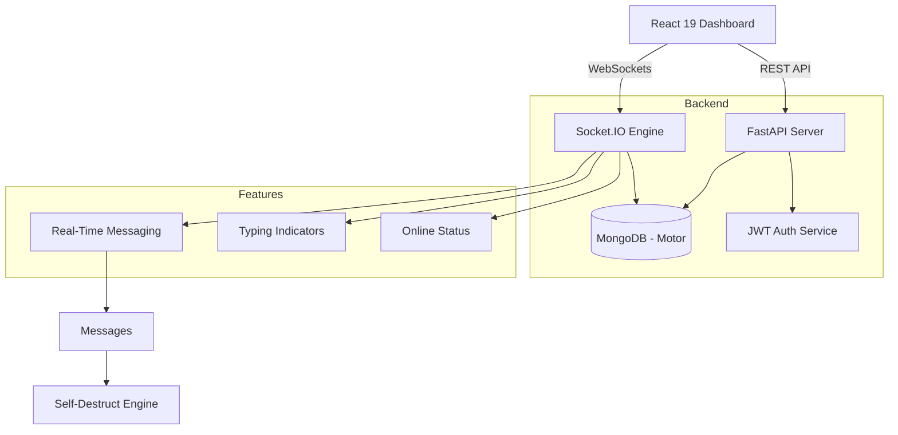

<div align="center">

# 💬 ChatterBox  — Real-Time Collaborative Messaging

**A high-performance, full-stack communication platform featuring real-time group dynamics, private messaging, and advanced usage analytics.**

[](https://python.org)
[](https://fastapi.tiangolo.com)
[](https://react.dev)
[](https://www.mongodb.com)
[](https://socket.io)
[](LICENSE)

</div>

---

## 📌 Overview

ChatterBox is a modern messaging ecosystem designed to bridge the gap between simple group chats and professional team collaboration tools. Built with a focus on real-time responsiveness and high-concurrency, the system provides a seamless environment for both public discussions and private, high-security conversations.

The platform solves core communication challenges through three primary pillars:

| Pillar | Implementation |
|---|---|
| **Real-Time Connectivity** | Bi-directional event streaming via Socket.IO for instant message delivery and status updates. |
| **Intelligent Organization** | A unified "Chats" tab that uses weighted recency algorithms to surface active conversations. |
| **Operational Transparency** | An admin dashboard providing live metrics on message throughput and group engagement. |

---

## 🏗️ Architecture



---

## 🗂️ Project Structure

```text
chatterbox/
│
├── backend/                        # FastAPI Application (Python)
│   ├── main.py                     # Entry point & Socket.IO initialization
│   ├── database.py                 # Async MongoDB connection (Motor)
│   ├── requirements.txt            # Python dependencies
│   ├── models/
│   │   ├── user.py                 # Pydantic Auth models
│   │   ├── group.py                # Group & DM schema definitions
│   │   └── message.py              # Message storage & TTL schemas
│   ├── routes/
│   │   ├── auth.py                 # JWT Authentication & Registration
│   │   ├── groups.py               # Group management & DM lookup logic
│   │   └── stats.py                # High-performance aggregation queries
│   └── sockets/
│       └── chat.py                 # Socket.IO event handlers (Join/Leave/Send)
│
├── frontend/                       # React Application (Vite)
│   ├── package.json                # Node dependencies
│   ├── vite.config.js              # Build configuration
│   └── src/
│       ├── main.jsx                # DOM Entry point
│       ├── App.jsx                 # React Router & Protected Routes
│       ├── index.css               # Global Glassmorphism Design System
│       ├── context/
│       │   └── AuthContext.jsx     # Global Authentication & Socket State
│       ├── services/
│       │   ├── api.js              # Axios interceptors & API instances
│       │   └── socket.js           # Socket.IO connection manager
│       └── pages/
│           ├── Auth.jsx            # Unified Login/Register view
│           ├── ChatDashboard.jsx   # Core Chat UI (Sidebar, Messages, Input)
│           └── Stats.jsx           # Animated Admin Dashboard
│
├── .gitignore                      # Professional exclusion rules
├── LICENSE                         # MIT License
└── README.md                       # Comprehensive Documentation
```

---

## 🚀 Key Features

### 🔒 Security & Identity Protection
- **JWT API Guard**: All endpoints (such as `/api/auth/users`, `/api/groups`, and `/api/stats`) are protected via FastAPI dependencies. Unauthenticated requests are automatically blocked.
- **Handshake Authentication**: WebSockets are secured via JWT handshake validation (`socket.auth.token`). Connections with expired or missing tokens are rejected immediately.
- **Anti-Spoofing Verification**: The backend relies solely on the verified connection state (`connected_users`) mapping sockets to database identities. Sender payloads sent by the frontend are ignored, preventing identity spoofing.

### 📡 Real-Time Interactions & Presence
- **Instant Messaging**: High-performance delivery with real-time double-tick read receipts (`✓` sent, `✓✓` seen).
- **Auto-Presence System**: Robust user presence tracking. If a user disconnects, closes their browser tab, or their system sleeps, the server catches the disconnect event, updates MongoDB (`isOnline: false`), and broadcasts the offline status in real-time.
- **Typing Indicators**: Visual feedback when a participant is actively typing inside an open chat room.

### 👥 Advanced Group Dynamics & UX
- **Weighted Chats Sidebar**: Direct DMs and Group chats are shown in the "Chats" tab only if they have message history (non-empty chats).
- **Seen Message Deletion Guard**: Message deletion is strictly restricted. Only the sender can delete a message, and only if it has **not** been read/seen by any other group member yet (i.e. before it shows double-checkmarks `✓✓`).
- **Real-Time Deletion Syncing**: Deleting a message dynamically updates the sidebar preview to show the second-to-last message. If the deleted message was the only message in the conversation, the chat is instantly removed from the Chats tab.
- **Alphabetical Directory**: The "People" tab functions as a clean contact list, sorted alphabetically with all notifications and unread badges disabled. All dynamic notifications and counts are handled exclusively under the "Chats" tab.
- **Auto-Switch Sidebar Tab**: Opening a new contact from "People" lets you preview the chat screen, and the tab automatically switches to "Chats" only when you send the first text message.
- **"You" Preview Prefix**: Displays `"You: [message]"` instead of your username for your own last sent messages in the sidebar.
- **Self-Destructing Messages**: Per-message TTL (Time-To-Live) settings (24h, 7d, or Manual).
- **Full-Text Search**: Native MongoDB text indexing allows users to instantly search message history within any group.
- **Integrated Glassmorphic Modals**: Fluid, custom modal overlays for delete confirmations and notifications, designed to match the application's unified design system.

### 📊 Server Analytics
- **Aggregation Pipeline**: Real-time MongoDB queries to calculate message volume.
- **Visual Insights**: Animated bar charts showing engagement metrics across the top active groups.

---

## ⚙️ Tech Stack

| Layer | Technology |
|---|---|
| **Backend API** | FastAPI, Python 3.10+ |
| **Real-time Engine** | Socket.IO (ASGI mode) |
| **Database** | MongoDB (Motor Async Driver) |
| **Authentication** | JWT (JSON Web Tokens) with Passlib (bcrypt) |
| **Frontend UI** | React 19, Vite, React Router 7 |
| **Iconography** | Lucide React |
| **Styling** | Modern CSS (Glassmorphism, Backdrop Blurs, CSS Variables) |

---

## 🔌 API Reference

Base URL: `http://localhost:8000/api`

| Method | Endpoint | Description |
|---|---|---|
| `POST` | `/auth/register` | Create a new user account |
| `POST` | `/auth/login` | Authenticate and receive JWT token |
| `GET` | `/auth/users` | Fetch all registered users |
| `GET` | `/auth/users/{id}` | Fetch a specific user's details |
| `GET` | `/groups/user/{id}` | Fetch all conversations (Groups + DMs) for a user |
| `POST` | `/groups/create` | Create a new Group or DM channel |
| `GET` | `/groups/dm/{u1}/{u2}`| Retrieve private conversation channel between two users |
| `GET` | `/groups/{id}/messages`| Fetch historical message log for a room |
| `GET` | `/groups/{id}/search?q=...`| Perform a full-text search on messages in a group |
| `GET` | `/stats/group-activity`| Aggregate system-wide messaging metrics |

---

## 🚀 Getting Started

### 1. Prerequisites
- **Python 3.10+** & **Node.js 18+**
- **MongoDB** (Local or Atlas instance)

### 2. Backend Configuration
```bash
cd backend
python -m venv venv
source venv/bin/activate  # Windows: .\venv\Scripts\activate
pip install -r requirements.txt
```
Create a `.env` in `backend/`:
```env
MONGO_URI=mongodb://localhost:27017
DB_NAME=chatterbox
JWT_SECRET=your_secret_key
```
Start server: `uvicorn main:combined_app --reload`

### 3. Frontend Configuration
```bash
cd frontend
npm install
npm run dev
```
Navigate to `http://localhost:5173`.

---

## 📄 License

This project is licensed under the **MIT License** — see the [LICENSE](LICENSE) file for details.
